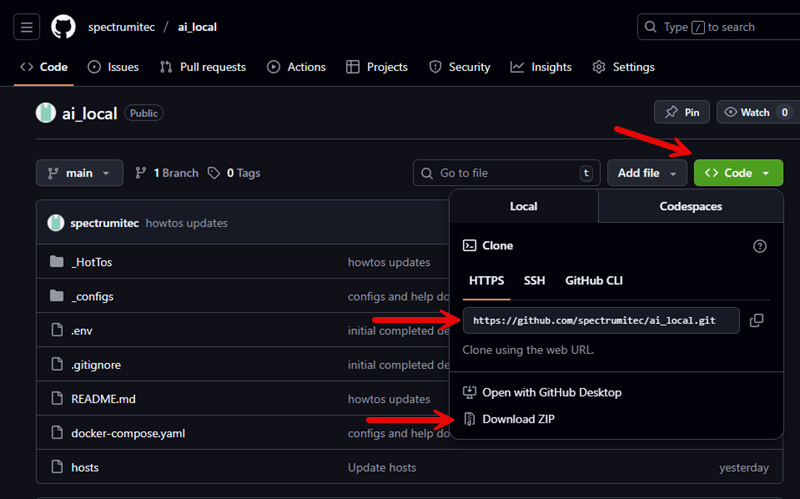
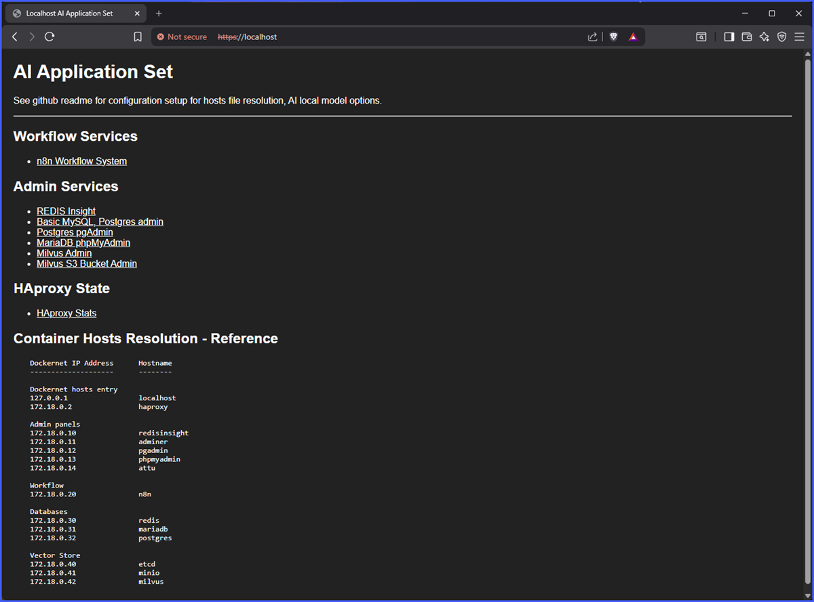

# AI Local System

This project is focused toward a use for proof of concept (POC), testing and a starting point for learning AI and tools with AI model software. This project lends fairly well to portable installations on laptop or desktop PC. This is not meant for production workloads.

## Limitations

- n8n is not able to interface with Google drive or other services in this type of configuration (OAuth limitations)
- Not production usable
- Security not built to maximum settings, do not store sensitive data
- No warrently or support

## Containers Deployed in this Project

- HAproxy (web services proxy)
- Ubuntu (Basic web dashboard - landing page)
- n8n Workflow and AI Automation
- Redis
- Redis Insight (Redis store viewer)
- Postgres
- Postgres pgAdmin (Postgres admin)
- MariaDB
- MariaDB phpMyAdmin (MariaDB admin)
- Adminer (General all purpose Database management tool)
- Milvus (Vector Database)
- Milvus etcd service
- Milvus MinIO service (S3 bucket)
- Milvus attu (Admin panel)

## What You Need To Start

You will need internet access from the laptop or PC that will be running these tools and you will need proper administrator access.

Assuming you are using a local PC or laptop that already has a GPU card installed (NVIDIA or AMD), these are a few tool installs needed to begin.

Docker Components for container deployment needed for this project:

- Docker Desktop: https://www.docker.com/get-started/

(Optional) Git tools. Manual download and extract possible from Github which doesn't need the git tools.

- Git:
  - Windows: https://git-scm.com/install/windows
  - Mac: https://git-scm.com/install/mac
  - Linux: https://git-scm.com/install/linux
- Git for Windows: https://gitforwindows.org/

(Optional) AI software tools (Local AI models):

- LM Studio for AI models: https://lmstudio.ai/download
- Ollama for AI models: https://www.ollama.com/download

<b>NOTE</b>: It is also possible to have LM Studio or Ollama installed on different systems as long as you can reach them over the network. This might work well if you have access to one or more systems with GPUs installed that you may want to take advantage of or test different AI model software.

You can also use cloud based AI tools like OpenAI, etc. Cloud hosted is subject to costs as per services.

## Help With Initial Tools Installation Locally

If you need some help to install and configure, you can use the '\_HowTos' folder above with helpers on how to install and configure.

<a href="https://github.com/spectrumitec/ai_local/blob/main/_HotTos/1_LM_Studio.md" target="_blank">LM Studio Install and Configure</a>
<a href="https://github.com/spectrumitec/ai_local/blob/main/_HotTos/2_Docker_Desktop_Setup.md" target="_blank">Docker Desktop Installation and pull repository</a>

## Basic Install and Setup of this Repository

LM Studio or Ollama (or cloud AI services) are not yet needed at this stage of setup. It wll only be needed once using some of the applications in this repository, like 'n8n', which has AI agent nodes and functions that need to leverage AI software.

<table>
<tr><td>

After installing Docker Desktop or Docker, create a new folder on your local system drive for housng these repository files.

</td></tr><tr><td>

There are two way to pull down the Git repository. Either use a 'git' tool to clone the repository to a folder or download the zip file and extract it to a folder.

Github code menu:

If using the 'git' tool, open a terminal, navigate to the folder and run the following command.

<pre>
git clone https://github.com/spectrumitec/ai_local.git .
</pre>

The following folder structure is pulled from the repository or extracted from the zip file.

<pre>
  new_folder
    ├ _HowTos               How To doc helpers and samples
    ├ _configs              Holds confiuration files, SSL certificates, and some container scripts
    ├ .env                  Default variables for compose file (default user and passwords)
    ├ .gitignore            Ignore file for excluding folders when pushed to a git repo
    ├ README.md             This file
    ├ docker-compose.yml    Docker compose file (application startup)
    └ hosts                 Hosts entries for local PC or Laptop
</pre>

</td></tr><tr><td>

Before deploying, you may want to change the default root or admin credentials in the '.env' file. These are applied to database server, database admin panels and Milvus S3 bucket, etc. Some admin panels are not configured with login credentials like Milvus and Redis.

Defaults are:

<pre>
DEFAULT_USERNAME=root
DEFAULT_PASSWORD=P@ssw0rd
</pre>

Usernames will apply as the following:

- root
- root@local (pgadmin only)

</td></tr><tr><td>

Run the docker compose from the command line to deploy the applications.

Open a terminal, navigate to the folder where the repository is located and run the following command.

<pre>
docker compose -f ./docker-compose.yaml up -d
</pre>

</td></tr><tr><td>

When the application containers are deployed, a docker network will be configured with internal network of 172.18.0.0/24. Each container will have it's own IP address in this docker network. Some of the containers have web services and connections to them will be handled via and HAproxy container using ACL rules. By default the ACLs are configured to only local naming (below). The HAproxy configuration can be modified as you need to resolve other naming if choosing to use DNS resolution. For basic setup, we will use localhost and hosts naming which doesn't depend on DNS services.

Your local system will need the following default hosts entries added to the hosts file.

- Windows: c:\windows\system32\drivers\etc\hosts
- Linux: /etc/hosts

Hosts file additions (local naming):

<pre>
# Add to hosts file
127.0.0.1   insight.local       # REDIS chat memory database (admin)
127.0.0.1   adminer.local       # Common Web Admin for MySQL, MariaDB, Postgres, etc
127.0.0.1   pgadmin.local       # PGAdmin local
127.0.0.1   phpmyadmin.local    # PHPMyAdmin
127.0.0.1   attu.local		      # Milvus Admin
127.0.0.1   minio.local		      # MinIO S3 bucket admin
127.0.0.1   n8n.local		        # Workflow application
</pre>

</td></tr>
</table>

## Additional Information

HAproxy config file is located at '\_configs/haproxy.cfg'.

SSL certificates are located in the '\_configs' folder. You may change with a trusted certificate.

- ssl.crt (certificate file)
- ssl.key (private key)
- ssl.pem (cert + key) for HAproxy rules

The following is the docker network host entries. File '\_configs/container_hosts' are mapped to each container for local docker network resolution:

<pre>
# Container localhost
127.0.0.1        localhost

# Proxy host
172.18.0.2       haproxy

# Admin panels
172.18.0.10       redisinsight
172.18.0.11       adminer
172.18.0.12       pgadmin
172.18.0.13       phpmyadmin
172.18.0.14       attu

# Workflow
172.18.0.20       n8n

# Databases
172.18.0.30       redis
172.18.0.31       mariadb
172.18.0.32       postgres

# Vector Store
172.18.0.40       etcd
172.18.0.41       minio
172.18.0.42       milvus
</pre>

Application folders for persistant data storage are created on docker compose

<pre>
  new_folder
    ├ _HowTos               How To doc helpers and samples
    ├ _configs              Holds confiuration files, SSL certificates, and some container scripts
    ├ .env                  Default variables for compose file (default user and passwords)
    ├ .gitignore            Ignore file for excluding folders when pushed to a git repo
    ├ application           App persistent storage
    │   ├ adminer           Adminer DB admin
    │   ├ mariadb           MariaDB DB storage and phpMyAdmin
    │   ├ milvus            Milvus DB, S3 bucket, etcd, admin
    │   ├ n8n               n8n application data
    │   ├ postgres          postgres DB storage and pgAdmin
    │   └ redis             redis DB storage and pgAdmin
    ├ n8n-workflow          n8n container mount (/workflow)
    ├ README.md             This file
    ├ docker-compose.yml    Docker compose file (application startup)
    └ hosts                 Hosts entries for local PC or Laptop
</pre>

NOTE: Specifically to n8n, the path 'n8n-workflow' is a local system folder you can place documents and files for specific purposes in n8n workflows. Example may be if creating file output from n8n, ingesting PDF or other documents for RAG, or other use cases.

## Start page

After a few minutes post startup, you can access https://localhost to see an available menu of web services.

## HowTos and Helpers

See '\_HowTos' folder

https://github.com/spectrumitec/ai_local/tree/main/_HotTos
