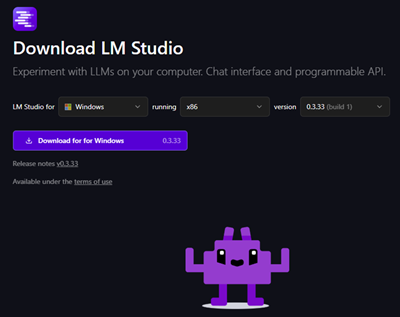
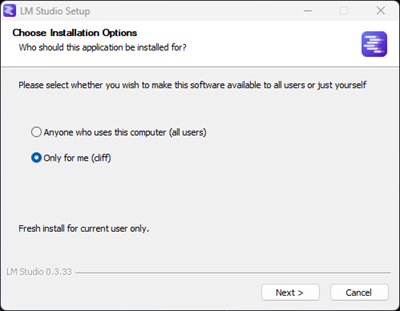
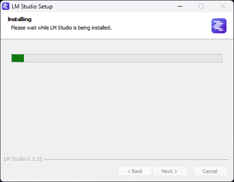
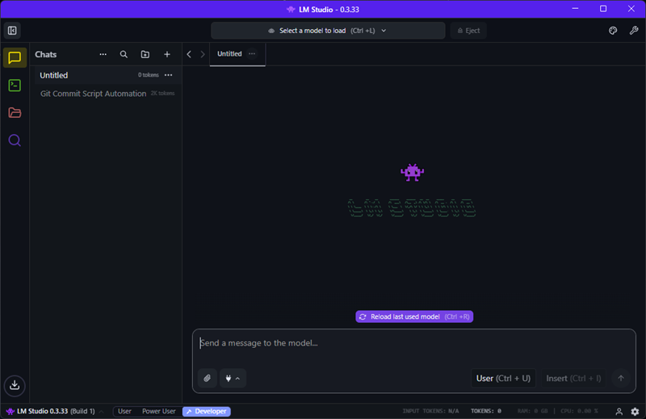
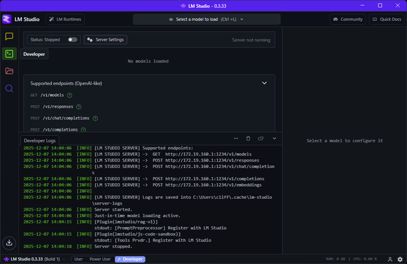
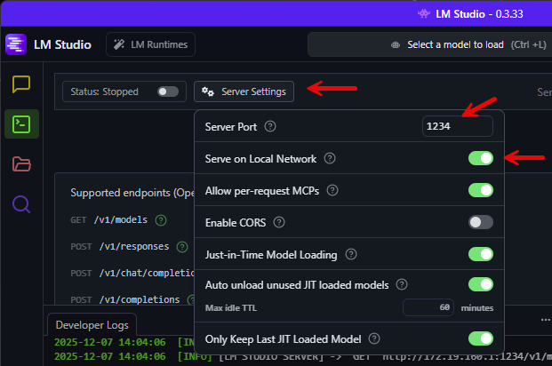
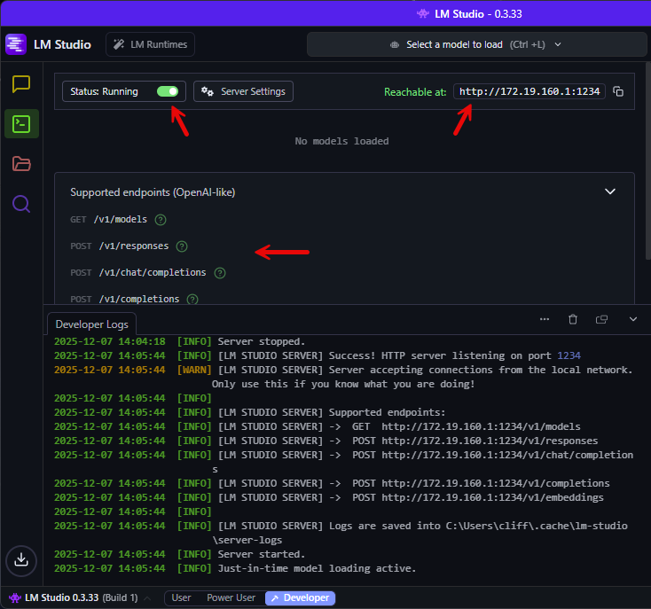
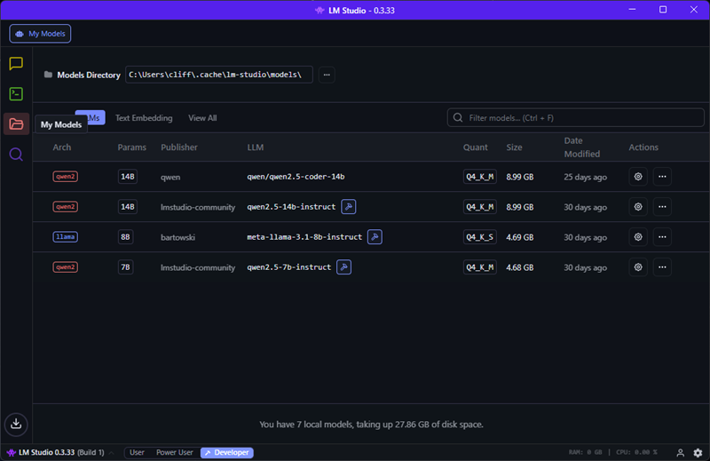
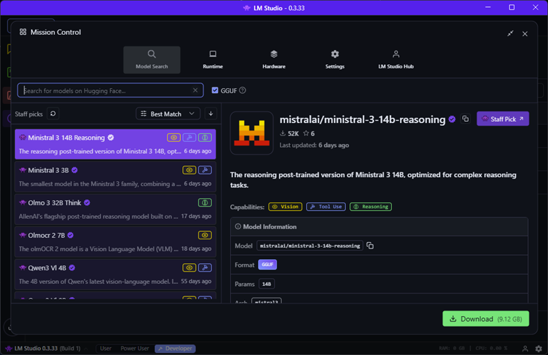

# LM Studio

This instructions are for Windows where Linux and Mac may differ.

Download from the site: https://lmstudio.ai/download

## Install

These are general steps to install the applicaition. You can leave the steps as default to complete the installation.

## Application Overview

When opening the application you may start at the 'Developer' tab. Starting from top left navigation, the 'Chat' window is where you can do some basic chat to the AI models and test with file uploads and other advanced uses like plugins.

The 'Developer' tab allows you to setup a web listener for LM Studio which acts similar to OpenAI APIs. Turning on 'Server on Local Network' will allow other systems on the network to access the LM Studio API. The application needs to be running to be able to access via network.

Configuring the web services

Turning on the web service, what IP it is bound to, and what are the API URLs

The 'My Models' tab shows you what models you have installed.

The 'Discover' tab allows you to search and install new models.

