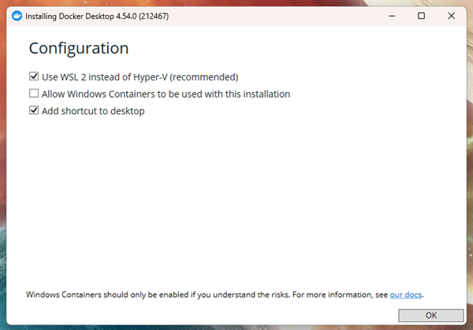
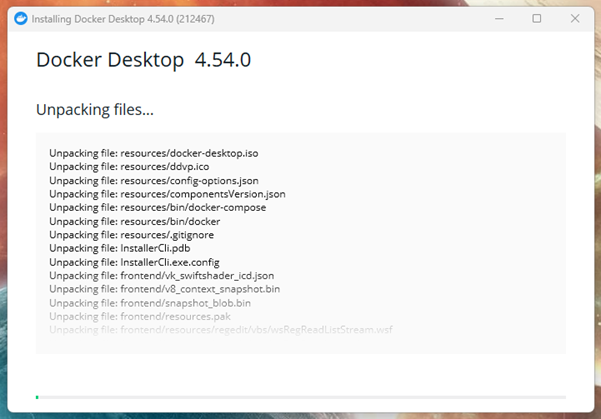
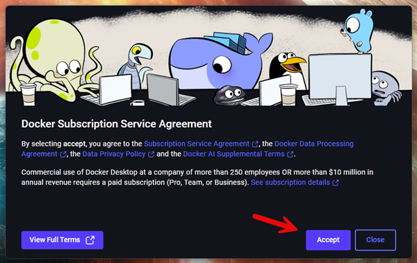
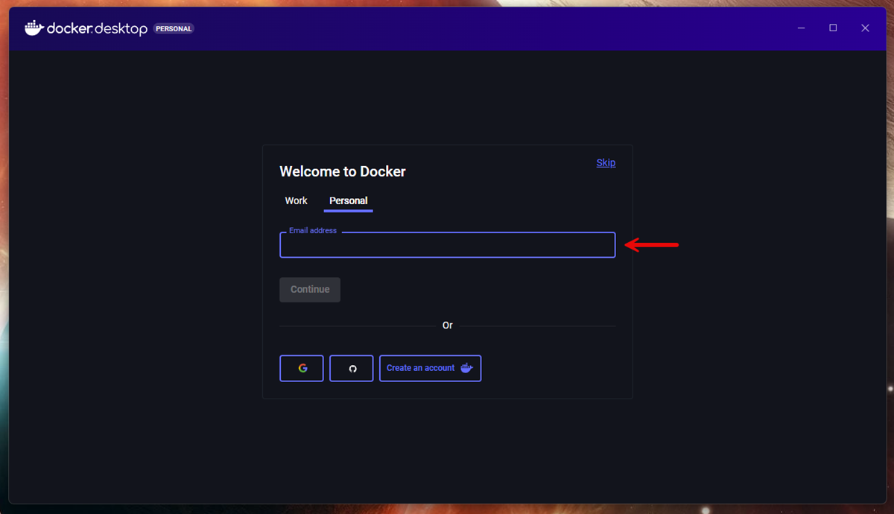
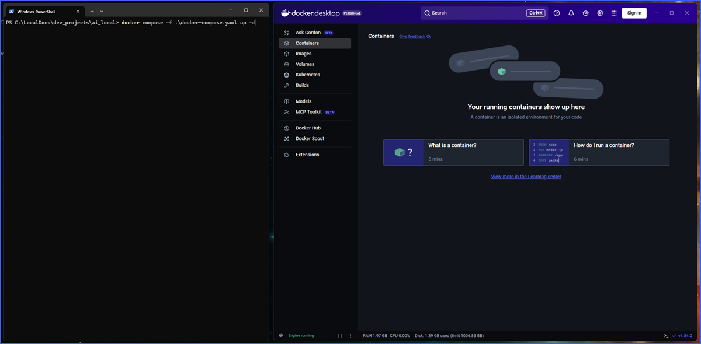
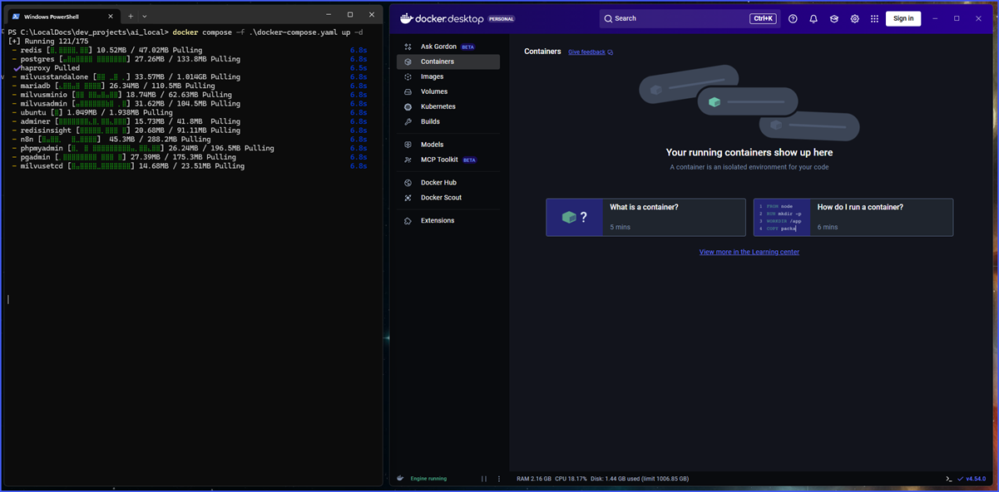
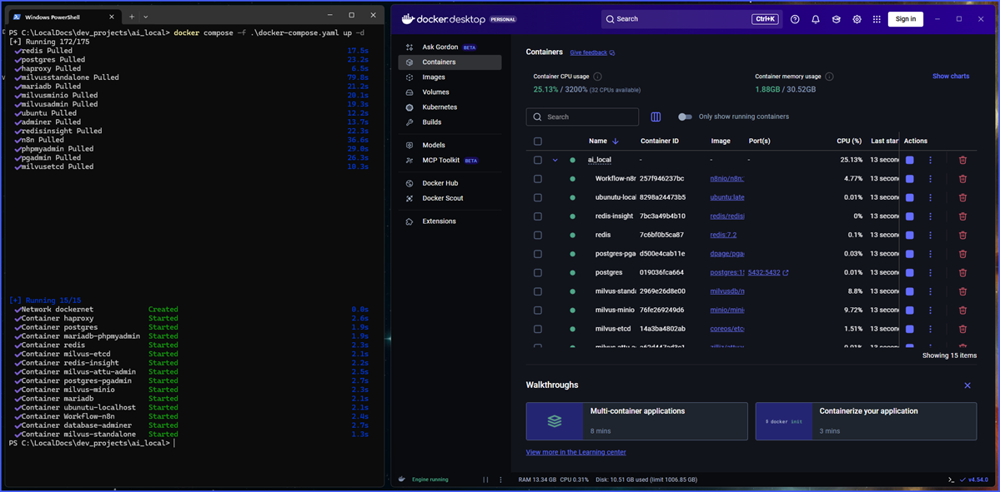
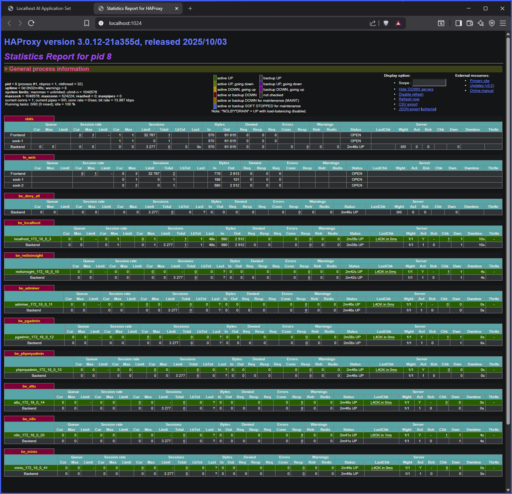

# Docker Setup and Initial Deployment

Download and install Docker

Launch the docker application and login

Initial deployment:

- Create a folder
- Open a console
- Navigate to folder
- Git pull repository
- Run the deployment command

Reference README:

<pre>
git clone https://github.com/spectrumitec/ai_local.git .
</pre>
<pre>
docker compose -f ./docker-compose.yaml up -d
</pre>

Open 'http://localhost' to see initial dashboard

On dashboard is a stats page for making sure services are running and HAproxy sees everything as up state (green)

