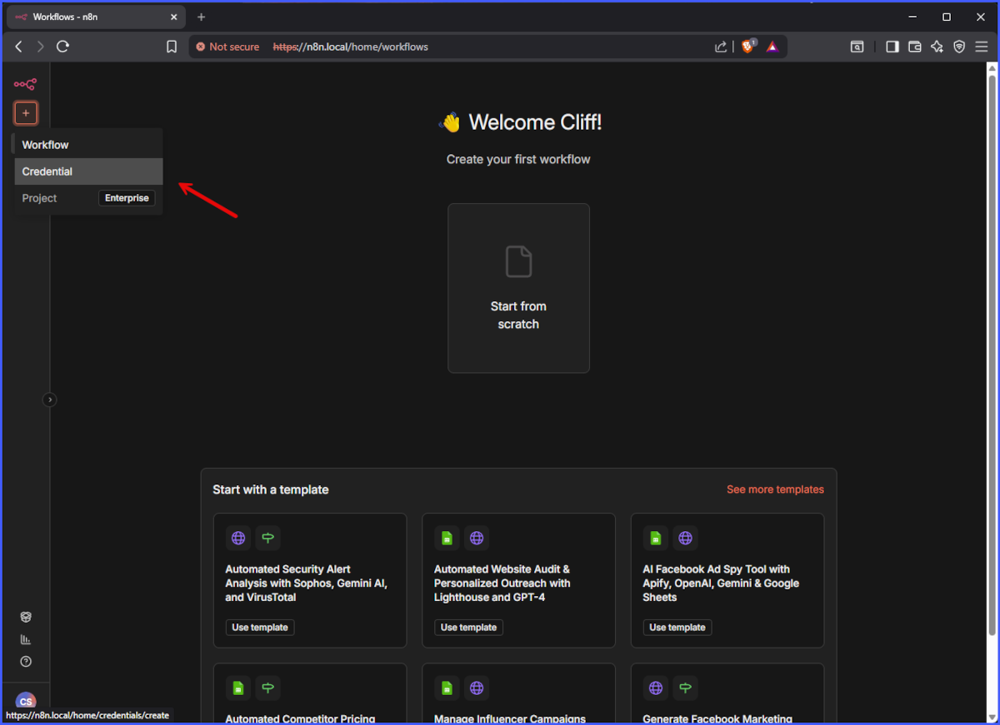
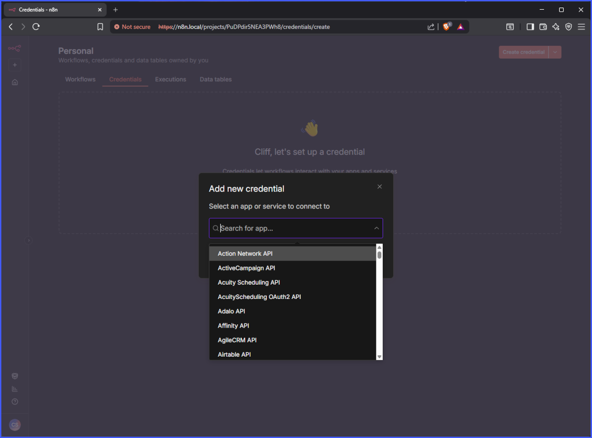
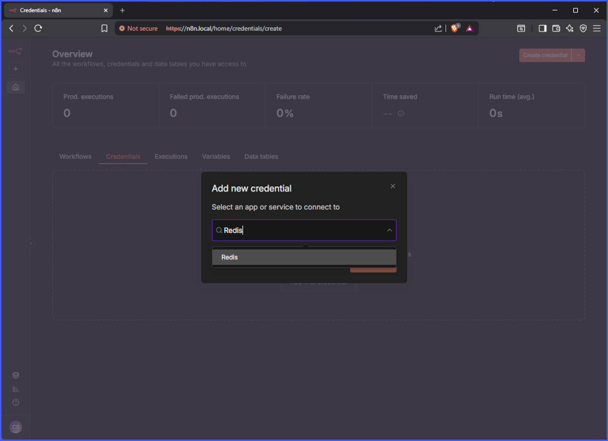
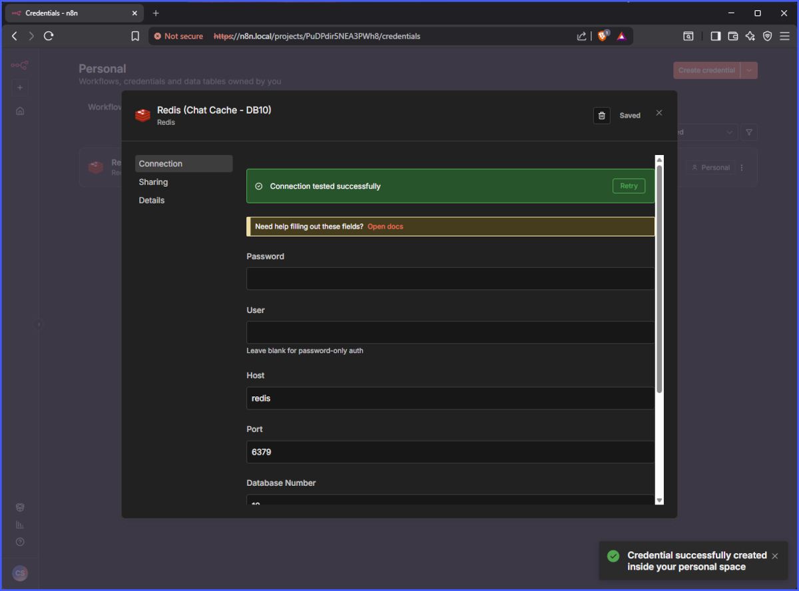
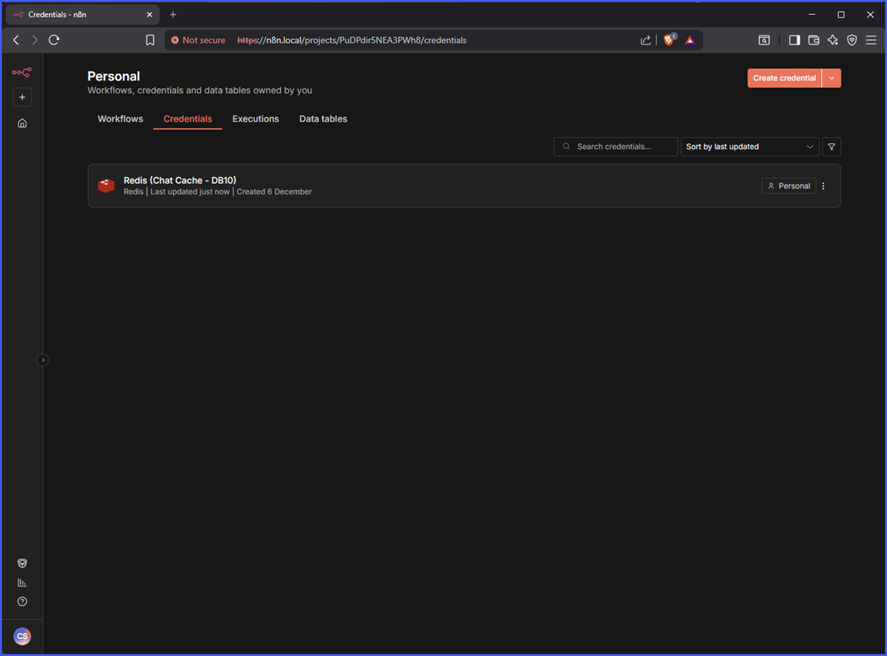

# n8n Creds Setup

Continuing from n8n setup and activation, this is an example of setting up credential to the local docker applications that should be running by now.

Please note the following docker network hosts resolution. This file is located in '\_configs/container_hosts'.

<pre>
# Dockernet hosts entry
127.0.0.1	    localhost
172.18.0.2	    haproxy

# Admin panels
172.18.0.10	    redisinsight
172.18.0.11	    adminer
172.18.0.12	    pgadmin
172.18.0.13	    phpmyadmin
172.18.0.14	    attu

# Workflow
172.18.0.20	    n8n

# Databases
172.18.0.30	    redis
172.18.0.31	    mariadb
172.18.0.32	    postgres

# Vector Store
172.18.0.40	    etcd
172.18.0.41	    minio
172.18.0.42	    milvus
</pre>

Select the 'Credentials' from left menu

Type the new credentials you would like to add. In this example 'Redis'

Enter the settings for Redis. This example is setting up Database 10 for Chat Memory. There is no user password set since this is a local instance running inside of a docker network.

As long as the service is running, you should see a successful connection message.

Finally seeing the newly added credential for Redis.

Add additional DB numbers for various use cases.
