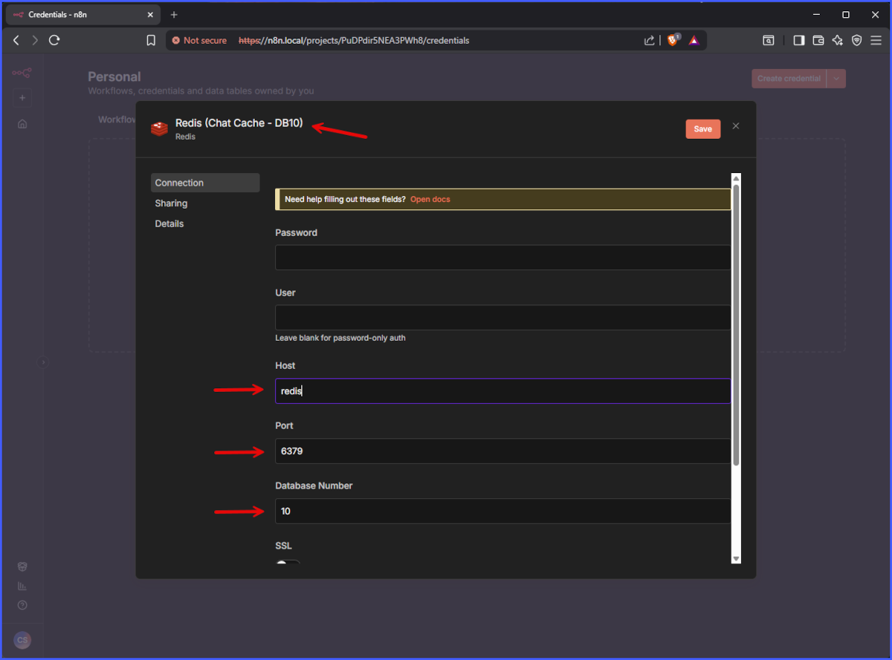
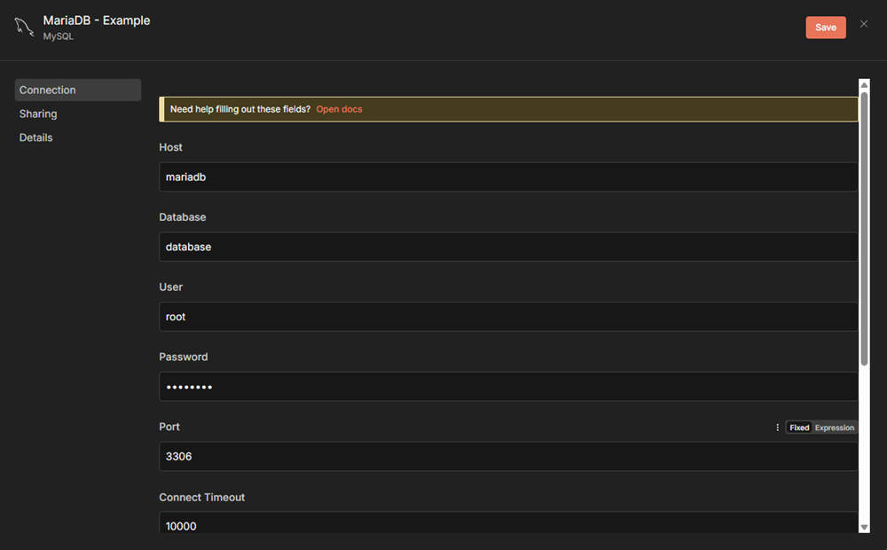
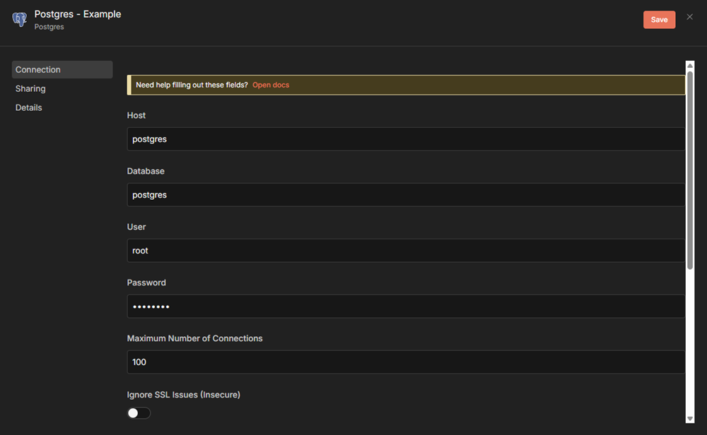
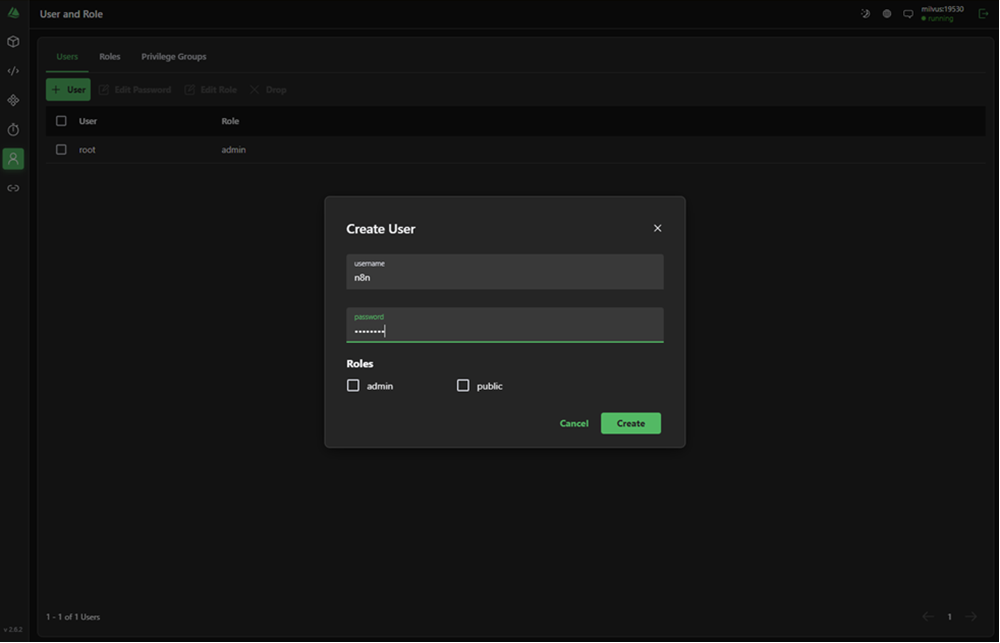
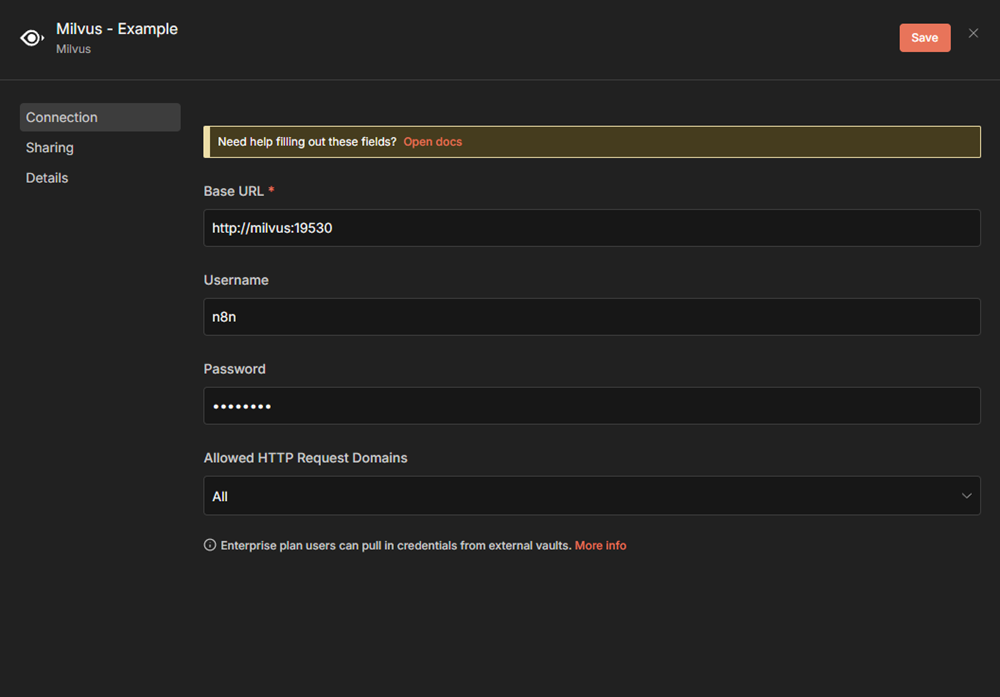
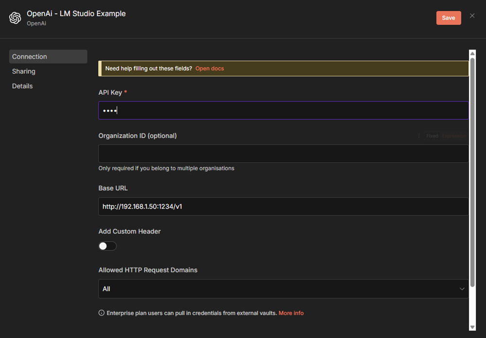
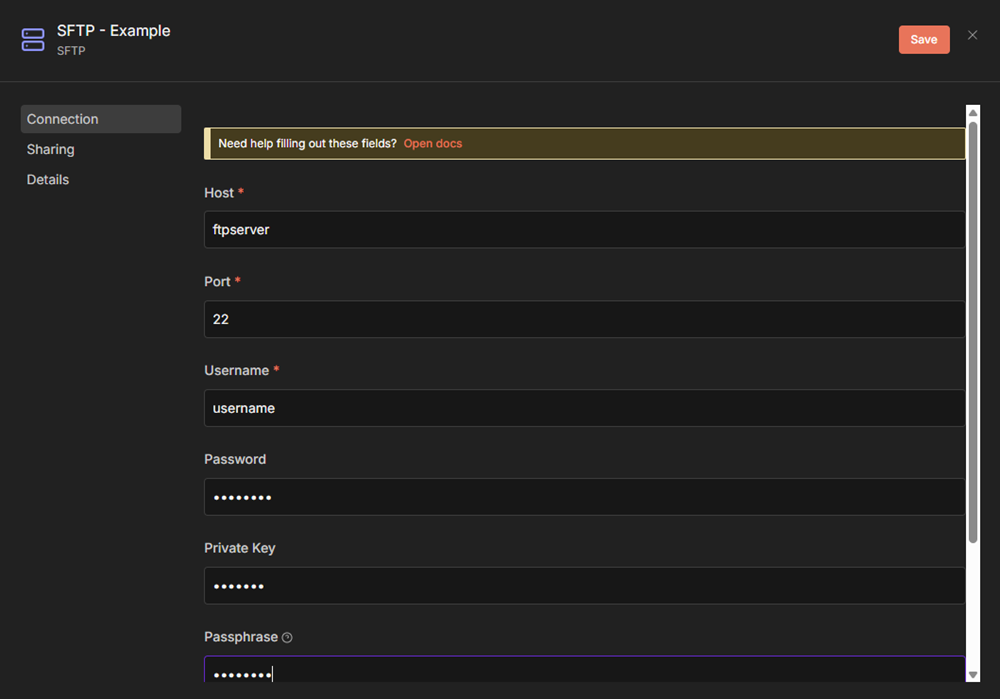

# n8n Creds References

For all default services, the following credentials examples can help getting setup:

- Mariadb
- Postgres
- Milvus
- LM Studio
- Ollama
- SFTP

NOTE: For database servers, there are no default databases created on general stand up. You will need to create databases and tables (and user / password if needed) to support the credentials setup.

## Example Credentials Setup

Redis:

MariaDB:

Postgres:

Milvus: (requires to add a user first). Connect to 'https://attu.local/', Connect to Milvus (should be pre-populated), navigate to user, and add an 'n8n' account and password. Then add the credentials.

LM Studio:

Ollama:

SFTP:

