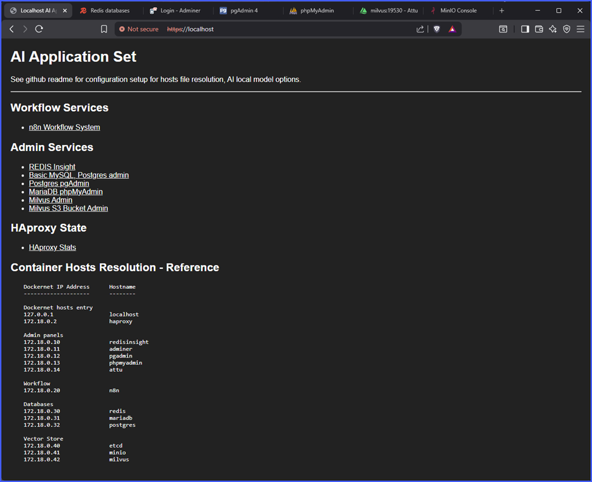
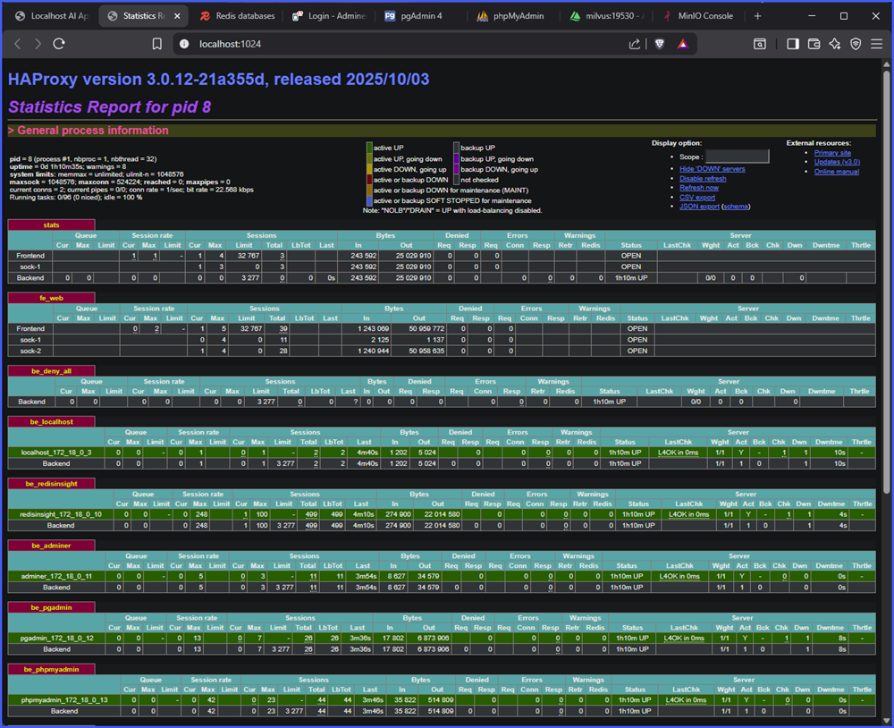
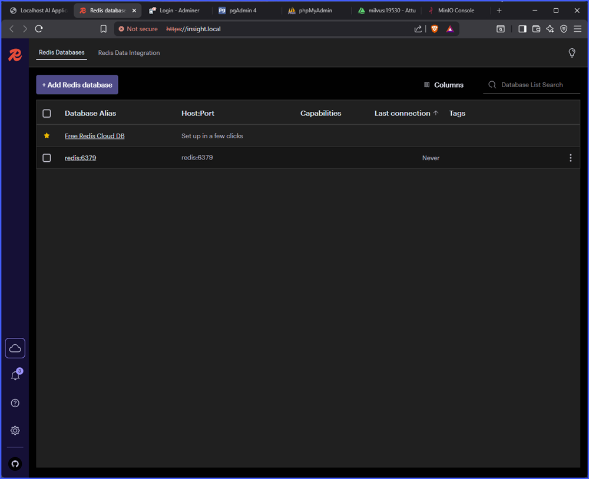
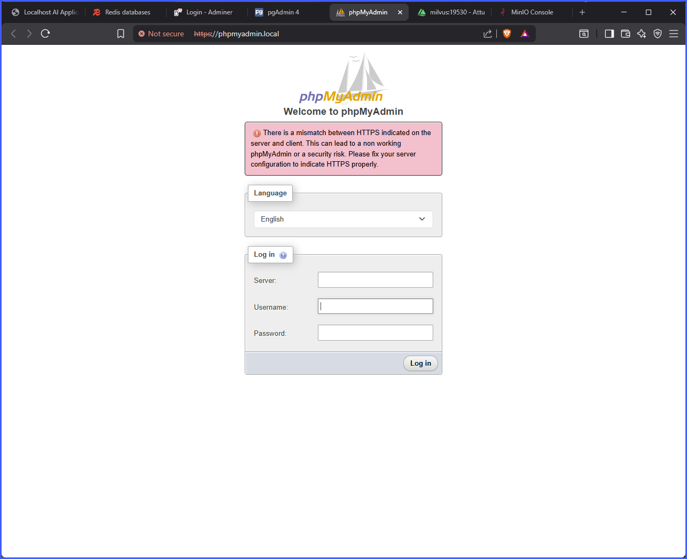
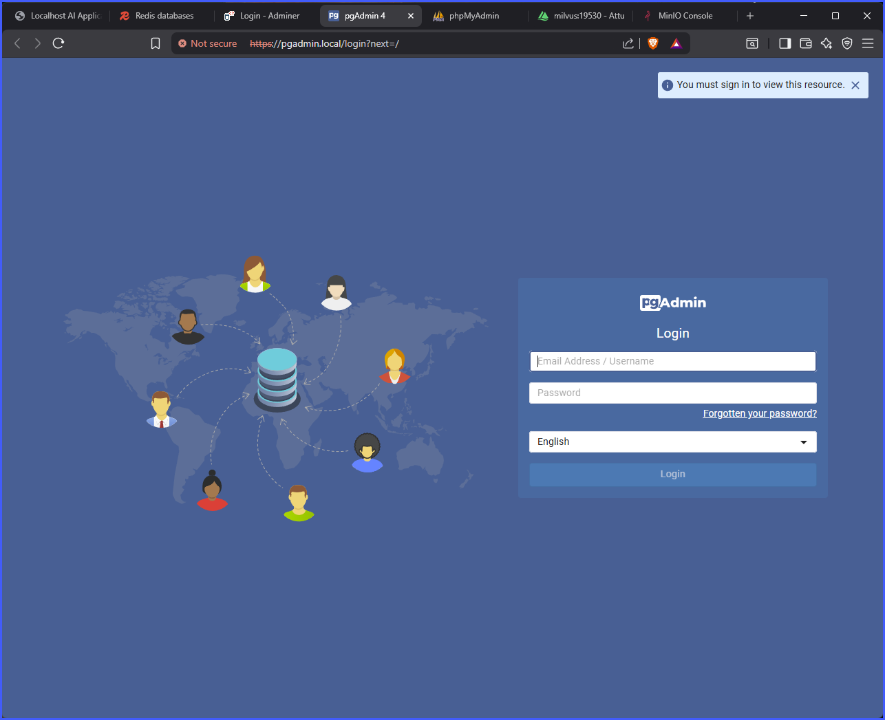
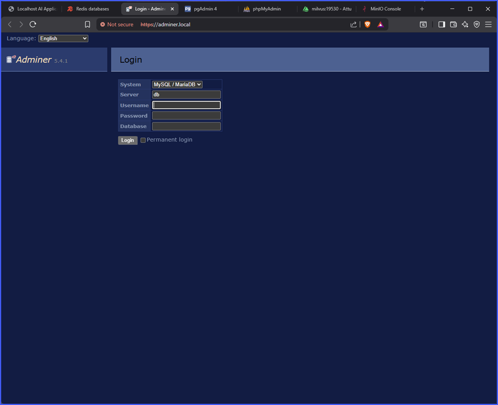
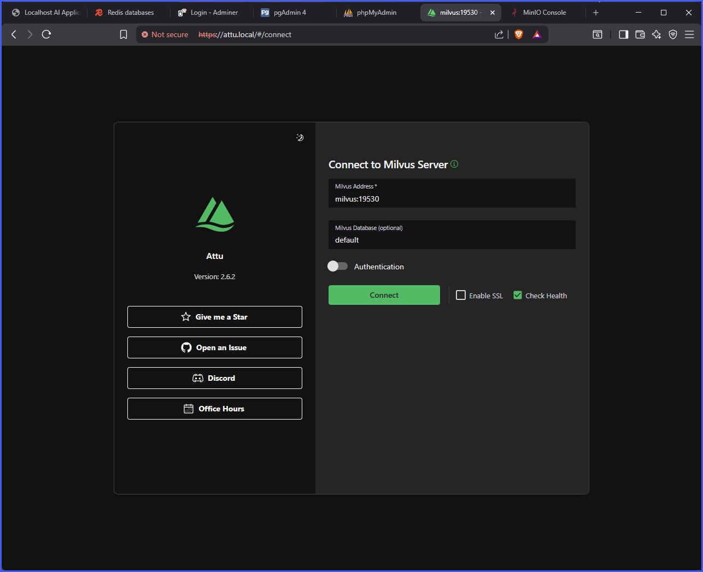
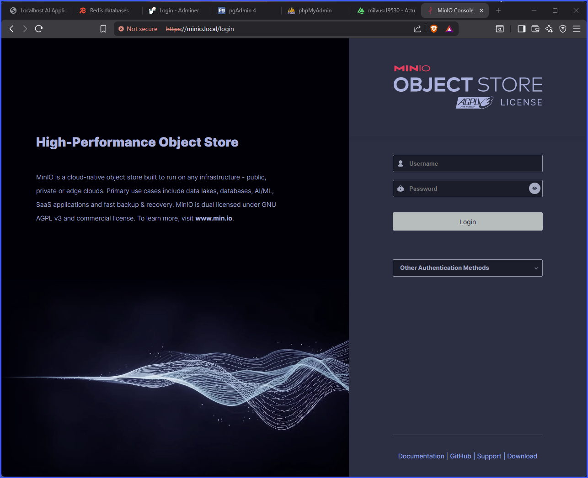

# Admin Panels

localhost:

localhost (haproxy stats page):

Redis Insight:

MariaDB (phpMyAdmin):

Postgres (pgAdmin):

Adminer (general use DB management):

Milvus Admin (attu)

Milvus Minio (S3 Bucket)

